# Docmost OSS MCP Shim

A lightweight Node.js bridge between AI agents (like **Cursor**, **Claude Desktop**, or any Model Context Protocol tool) and your **self‑hosted Docmost OSS instance**.

## ✨ Features

- 🔌 **Plug & Play MCP Integration** - Works with Cursor, Claude Desktop, and any MCP-compatible AI agent
- 🐳 **Docker Ready** - Deploy in seconds with Docker Compose on any platform
- 🥧 **Raspberry Pi Compatible** - Runs perfectly on ARM devices
- 🔒 **Secure** - API key authentication and session management
- 🔍 **Full-Text Search** - Search your documentation from within your IDE
- 📚 **Space Management** - List and browse all your Docmost spaces
- 🚀 **Auto-Authentication** - Handles Docmost login and cookie management automatically
- 📦 **Zero Dependencies on Docmost** - Works with any self-hosted Docmost OSS instance (v0.23+)

---

# 🤖 For MCP Users (AI Agents)

## Quick Start with Cursor

Add this to your Cursor MCP configuration (`~/.cursor/mcp.json`):

```json
{
  "mcpServers": {
    "docmost": {
      "command": "npx",
      "args": ["-y", "--package=github:dJPoida/docmost-oss-mcp-shim#v0.5.0", "docmost-mcp"],
      "env": {
        "MCP_DOCMOST_SHIM_URL": "http://YOUR_SHIM_SERVER_IP:3888",
        "MCP_SHIM_KEY": "your-secure-random-string"
      }
    }
  }
}
```

**Configuration:**

- Replace `YOUR_SHIM_SERVER_IP` with the IP address of your shim server (e.g., your Raspberry Pi)
- Replace `your-secure-random-string` with the same `SHIM_API_KEY` configured on your shim server
- Update the version tag (`#v0.5.0`) to match the latest release

## Available Tools

Your AI agent can use these Docmost tools:

- **`docmost_listSpaces`** - List available workspaces/spaces
- **`docmost_search`** - Search for pages by query (supports optional `spaceId`, pagination)
- **`docmost_getPage`** - Get full page content including attachments and diagrams ✅ **NEW!**
- **`docmost_getSpacePages`** - Get all pages in a specific space ✅ **NEW!**
- **`docmost_getAttachment`** - Get attachment content including draw.io diagrams ✅ **NEW!**
- **`docmost_getPageHistory`** - Get page version history and evolution ✅ **NEW!**
- **`docmost_getPageBreadcrumbs`** - Get page hierarchy and navigation context ✅ **NEW!**
- **`docmost_getComments`** - Get comments and discussions on pages ✅ **NEW!**
- **`docmost_health`** - Check shim server health

## Available Resources

Browse your Docmost documentation hierarchy:

- **`docmost://spaces`** - List of all available spaces
- **`docmost://all-pages`** - Complete overview of all pages across all spaces ✅ **NEW!**
- **`docmost://space/{spaceId}`** - Pages within a specific space
- **`docmost://page/{pageId}`** - Individual page metadata

## Available Prompts

Get guided assistance for documentation discovery:

- **`search-docs`** - Best practices for effective documentation search

### ✅ Enhanced Capabilities (v0.5.0+)

**Major Update: Full Page Content Access!** This integration now supports:

✅ **What Works:**

- List spaces and their metadata
- Search pages and see content highlights/snippets (with pagination)
- **🆕 Read full page content including text, headings, and embedded content**
- **🆕 Access draw.io diagrams and other embedded attachments**
- **🆕 Download actual attachment content (SVG, images, files)**
- **🆕 Browse complete page hierarchies within spaces**
- **🆕 Get attachment metadata and references**
- **🆕 Access page version history and track documentation evolution**
- **🆕 Understand page hierarchy and navigation context**
- **🆕 Read comments and discussions for additional context**
- **🆕 Get comprehensive overview of all documentation at once**
- Browse page hierarchies via MCP resources
- Get guided prompts for documentation discovery
- Cached responses for improved performance
- Automatic retry with exponential backoff for network resilience

❌ **What This MCP Cannot Do (Read-Only Design):**

- Create or modify pages
- Update page content or metadata
- Manage users, spaces, or permissions
- Any administrative functions

This MCP is designed as a **read-only documentation access tool** for AI agents. It provides comprehensive access to documentation content, structure, and context while maintaining a clear separation from administrative functions. All content editing must be done manually in the Docmost UI.

## Example Usage in Cursor

Simply ask Cursor natural language questions, and it will use the Docmost tools automatically:

- **"Search my Docmost for deployment documentation"**
- **"List all my Docmost spaces"**
- **"Show me the Environment Overview page with the draw.io diagram"**
- **"Get all pages in the Environments space"**
- **"Give me an overview of all documentation pages"**
- **"Download the draw.io diagram from the Environment Overview page"**
- **"Show me the version history of the Environment Overview page"**
- **"Get the breadcrumbs and hierarchy for this page"**
- **"Show me any comments or discussions on this documentation"**
- **"Find pages about environment variables"**

Cursor will discover your documentation and help you navigate it without leaving your IDE!

---

# 🛠️ For Shim Server Operators

## 🚀 Why This Exists

The open‑source edition of Docmost doesn't expose API keys or external automation features.  
This shim fills that gap by acting as an authenticated bridge between AI agents and your Docmost instance.

✅ No enterprise license required  
✅ No manual cookie management  
✅ Simple REST API for AI agents  
✅ Production-ready Docker deployment  
✅ Works on Raspberry Pi and ARM devices

## ⚙️ Setup

### 1️⃣ Requirements

- Node **v22+**
- A running self-hosted **Docmost OSS** instance (Docker or bare-metal)
- A Docmost user account for the shim (e.g. `my.docmost.mcp.user@gmail.com`)

### 2️⃣ Installation

```bash
git clone https://github.com/dJPoida/docmost-oss-mcp-shim.git
cd docmost-oss-mcp-shim
npm install
```

### 3️⃣ Configuration

Create a `.env` file in the project root:

```ini
# Docmost Connection (Required)
DOCMOST_BASE_URL=http://your-docmost-server:3000
DOCMOST_EMAIL=your-mcp-user@example.com
DOCMOST_PASSWORD=your-secure-password

# Shim Network Settings (Optional)
HOST=0.0.0.0  # Use 0.0.0.0 for Docker, 127.0.0.1 for local-only
PORT=3888

# Security (Required for remote access)
SHIM_API_KEY=your-secure-random-string

# Debug Logging (Optional)
DEBUG_SHIM=0  # Set to 1 for verbose logging

# Cache Settings (Optional)
CACHE_SPACES_TTL=300      # Spaces cache TTL in seconds (default: 5 minutes)
CACHE_SEARCH_TTL=120      # Search cache TTL in seconds (default: 2 minutes)
CACHE_MAX_ENTRIES=100     # Maximum cache entries (default: 100)

# Retry Settings (Optional)
RETRY_MAX_ATTEMPTS=3       # Maximum retry attempts (default: 3)
RETRY_MIN_TIMEOUT=1000     # Minimum retry timeout in ms (default: 1s)
RETRY_MAX_TIMEOUT=30000    # Maximum retry timeout in ms (default: 30s)
```

**Important:**

- Create a dedicated Docmost user for the shim (don't use your personal account)
- Use `HOST=0.0.0.0` for Docker deployments to allow external connections
- Generate a strong random string for `SHIM_API_KEY` in production

## ▶️ Run

```bash
npm start
```

Then verify:

```bash
curl http://127.0.0.1:3888/health
# → {"ok":true}
```

## 🧠 How It Works

All Docmost endpoints use **POST** requests behind `/api/*`.  
The shim mirrors that behavior and manages session cookies automatically.

| Shim Endpoint | Upstream Docmost API | Method | Description                      |
| ------------- | -------------------- | ------ | -------------------------------- |
| `/spaces`     | `/api/spaces`        | POST   | List available workspaces/spaces |
| `/search`     | `/api/search`        | POST   | Search pages by query            |
| `/pages`      | `/api/pages/create`  | POST   | Create new page                  |
| `/pages`      | `/api/pages/update`  | POST   | Update existing page             |

Authentication is handled via the `authToken` cookie issued by `/api/auth/login`.  
The shim logs in automatically and refreshes sessions when expired.

## 🔒 Security

- **Do not** expose this server to the public internet.  
  Keep it bound to localhost or behind a reverse proxy.
- Use a **dedicated Docmost account** for automation.
- Protect the `.env` file; it contains login credentials.
- Enable `SHIM_API_KEY` if you expect external tools to connect.

---

## 🧪 Testing Endpoints

```bash
# Health check
curl http://127.0.0.1:3888/health

# Detailed health check (includes Docmost connectivity)
curl http://127.0.0.1:3888/health/detailed | jq .

# List spaces
curl -H "X-SHIM-KEY: change-this-long-random-string"      http://127.0.0.1:3888/spaces | jq .

# Search for pages (with pagination)
curl -X POST -H "Content-Type: application/json"      -H "X-SHIM-KEY: change-this-long-random-string"      -d '{"query": "Docmost", "page": 1, "limit": 20}'      http://127.0.0.1:3888/search | jq .

# Get pages in a space
curl -H "X-SHIM-KEY: change-this-long-random-string"      http://127.0.0.1:3888/spaces/YOUR_SPACE_ID/pages | jq .

# Get specific page metadata
curl -H "X-SHIM-KEY: change-this-long-random-string"      http://127.0.0.1:3888/pages/YOUR_PAGE_ID | jq .

# Create new page
curl -X POST -H "Content-Type: application/json"      -H "X-SHIM-KEY: change-this-long-random-string"      -d '{"spaceId": "YOUR_SPACE_ID", "title": "MCP Test Page", "content": "Hello world"}'      http://127.0.0.1:3888/pages | jq .

# Update page
curl -X PUT -H "Content-Type: application/json"      -H "X-SHIM-KEY: change-this-long-random-string"      -d '{"pageId": "YOUR_PAGE_ID", "title": "MCP Test Page (Updated)"}'      http://127.0.0.1:3888/pages | jq .

# Debug current session / cookies / cache stats
curl http://127.0.0.1:3888/debug/session | jq .
```

---

## 🧑‍💻 Development

```bash
npm run build     # compile TypeScript (both MCP server and Express server)
npm run lint      # run ESLint on TypeScript and JavaScript files
npm run format    # format with Prettier
npm run dev       # development mode with auto-rebuild
npm run dev:watch # watch mode for development
DEBUG_SHIM=1 npm start  # enable verbose logging
```

**Note:** Both the MCP server and Express server are now written in TypeScript and must be compiled before use. The pre-commit hook automatically builds and includes the compiled files in commits.

### Publishing New Versions

#### Automatic Version Bumping

The project automatically bumps the patch version on every commit:

- **Every commit** automatically bumps the patch version (0.2.9 → 0.2.10)
- **Works with any git tool** - IDE sidebar, command line, etc.
- **Create tags** when ready to release:
  ```bash
  npm run tag  # Creates git tag from current version
  git push --tags  # Push tags to remote
  ```

#### Manual Version Management

For major/minor version changes:

1. **Manually update version** in `package.json` (e.g., 0.2.7 → 0.3.0)
2. **Commit and tag**:
   ```bash
   git commit -am "commit message"
   git tag <version>
   git push && git push --tags
   ```

#### MCP Users Update

After a new version is released, MCP users can update their Cursor config to the latest version tag:

```json
{
  "mcpServers": {
    "docmost": {
      "command": "npx",
      "args": ["-y", "--package=github:dJPoida/docmost-oss-mcp-shim#v0.2.27", "docmost-mcp"]
    }
  }
}
```

### Project structure

```
src/
  server.ts          # Express shim server (runs on remote machine)
  routes.ts          # defines REST endpoints
  docmostClient.ts   # handles login, cookies, API calls
  logger.ts          # lightweight debug logger
  cache.ts           # LRU cache implementation
  types.ts           # shared TypeScript interfaces

mcp/
  docmost-server.ts # MCP server TypeScript source

dist/
  src/              # Compiled Express server
  mcp/              # Compiled MCP server (runs on developer's machine via Cursor)
```

**Two-Server Architecture:**

- **Express Shim Server** (`src/`) - Runs on remote machine, connects to Docmost OSS
- **MCP Server** (`mcp/`) - Runs on developer's machine, connects to Express shim

---

## 🐳 Docker Deployment

### Using Docker Compose (Recommended)

1. **Create a `.env` file** with your Docmost credentials:

   ```ini
   DOCMOST_BASE_URL=http://your-docmost-server:3000
   DOCMOST_EMAIL=your-mcp-user@example.com
   DOCMOST_PASSWORD=your-secure-password
   SHIM_API_KEY=change-this-long-random-string
   DEBUG_SHIM=0
   ```

2. **Start the service**:

   ```bash
   docker-compose up -d
   ```

3. **Check logs**:

   ```bash
   docker-compose logs -f
   ```

4. **Stop the service**:
   ```bash
   docker-compose down
   ```

### Using Docker CLI

```bash
# Build the image
docker build -t docmost-oss-mcp-shim .

# Run the container
docker run -d \
  --name docmost-mcp-shim \
  --restart unless-stopped \
  -p 3888:3888 \
  -e DOCMOST_BASE_URL=http://your-docmost-server:3000 \
  -e DOCMOST_EMAIL=your-mcp-user@example.com \
  -e DOCMOST_PASSWORD=your-secure-password \
  -e SHIM_API_KEY=change-this-long-random-string \
  docmost-oss-mcp-shim
```

### Raspberry Pi Deployment

The Docker image is multi-arch and works on Raspberry Pi (ARM):

```bash
# On your Raspberry Pi
git clone https://github.com/dJPoida/docmost-oss-mcp-shim.git
cd docmost-oss-mcp-shim

# Create .env file with your settings
cat > .env << EOF
DOCMOST_BASE_URL=http://your-docmost-server:3000
DOCMOST_EMAIL=your-mcp-user@example.com
DOCMOST_PASSWORD=your-secure-password
SHIM_API_KEY=$(openssl rand -hex 32)
DEBUG_SHIM=0
EOF

# Start the service
docker-compose up -d

# Check status
docker-compose ps
docker-compose logs -f
```

**Performance Notes:**

- The default resource limits (0.5 CPU, 256MB RAM) work well on Raspberry Pi 3B+ and newer
- Adjust limits in `docker-compose.yml` if needed for older hardware

---

## 🔍 Troubleshooting

### MCP Connection Issues

**Problem:** Cursor shows "No server info found"

**Solutions:**

1. Verify the shim server is running: `curl http://YOUR_SERVER_IP:3888/health`
2. Check `MCP_DOCMOST_SHIM_URL` in `~/.cursor/mcp.json` is correct
3. Ensure `MCP_SHIM_KEY` matches the `SHIM_API_KEY` in your `.env` file
4. Restart Cursor after config changes

**Problem:** "Connection refused"

**Solutions:**

1. Ensure Docker container is running: `docker-compose ps`
2. Check if port 3888 is accessible: `telnet YOUR_SERVER_IP 3888`
3. Verify firewall rules allow connections to port 3888
4. For Docker: Ensure `HOST=0.0.0.0` in `.env` file

### Authentication Issues

**Problem:** "Invalid credentials" or "Login failed"

**Solutions:**

1. Verify credentials in `.env` file are correct
2. Test login manually in Docmost web UI
3. Check Docker logs: `docker-compose logs -f`
4. Enable debug logging: `DEBUG_SHIM=1` in `.env`

### Docker Issues

**Problem:** Container exits immediately

**Solutions:**

1. Check logs: `docker-compose logs`
2. Verify `.env` file exists and has correct format
3. Ensure Docmost server is accessible from Docker container
4. Try building fresh: `docker-compose down && docker-compose up --build`

**Problem:** "npm ci failed" during build

**Solution:** This is fixed in v0.2.27+. Update to latest version.

---

## 🩵 License

MIT — freely reusable for self‑hosted setups.  
Not affiliated with the official Docmost project.

---

## 🆕 New Features (v0.3.0+)

### Enhanced Reliability

- **Automatic Retry Logic**: Network requests automatically retry with exponential backoff (1s → 2s → 4s)
- **Comprehensive Health Checks**: `/health/detailed` endpoint validates Docmost connectivity and authentication
- **TypeScript Migration**: Full type safety for the Express server with shared interfaces

### Performance Improvements

- **LRU Caching**: Spaces and search results are cached with configurable TTL
- **Pagination Support**: Search results support pagination with metadata
- **Cache Invalidation**: Caches automatically invalidate when content changes

### Enhanced MCP Features

- **MCP Resources**: Browse documentation hierarchy (`docmost://spaces`, `docmost://space/{id}`, `docmost://page/{id}`)
- **MCP Prompts**: Guided assistance for common tasks (create-page, search-docs, update-page-title)
- **Extended Tool Parameters**: Search tools now support pagination parameters

### Configuration Options

```ini
# Cache settings
CACHE_SPACES_TTL=300      # 5 minutes
CACHE_SEARCH_TTL=120      # 2 minutes
CACHE_MAX_ENTRIES=100

# Retry settings
RETRY_MAX_ATTEMPTS=3
RETRY_MIN_TIMEOUT=1000
RETRY_MAX_TIMEOUT=30000
```

## 🔁 Architecture Overview

```mermaid
flowchart LR
  subgraph A[AI Agent / Cursor MCP]
    X1["docmost_search()"]
    X2["docmost_createPage()"]
    X3["MCP Resources"]
    X4["MCP Prompts"]
  end

  subgraph B[MCP Server TypeScript]
    M1["docmost_search"]
    M2["docmost_createPage"]
    M3["docmost_listSpaces"]
    M4["Resources & Prompts"]
  end

  subgraph C[Express Shim Server]
    S1["/search (POST)"]
    S2["/pages (POST/PUT)"]
    S3["/spaces (GET)"]
    S4["/spaces/:id/pages (GET)"]
    S5["/pages/:id (GET)"]
    S6["/health/detailed (GET)"]
  end

  subgraph D[Docmost OSS Server]
    D1["/api/search"]
    D2["/api/pages/create"]
    D3["/api/spaces"]
  end

  subgraph E[Cache Layer]
    E1["LRU Cache"]
    E2["Retry Logic"]
  end

  A -->|MCP Protocol| B
  B -->|HTTP + X-SHIM-KEY| C
  C -->|Cached/Retry| E
  E -->|authToken cookie| D
```


