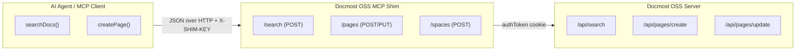

# Docmost OSS MCP Shim

A lightweight Node.js bridge between AI agents (like **Cursor MCP**, **Claude Code**, or any Model Context Protocol tool) and your **self‑hosted Docmost OSS instance**.

This shim uses the **same endpoints and cookie‑based authentication** as the official Docmost API (v0.23+). It allows agents to query, search, and edit documentation just like a logged‑in user.

---

## 🚀 Why This Exists

The open‑source edition of Docmost doesn’t expose API keys or external automation features.  
This shim fills that gap by acting as a local authenticated bridge.

✅ No enterprise license required  
✅ No manual cookies or tokens  
✅ Simple REST API agents can call locally

---

## ⚙️ Setup

### 1️⃣ Requirements

- Node **v22+**
- A running self-hosted **Docmost OSS** instance (Docker or bare-metal)
- A Docmost user account for the shim (e.g. `my.docmost.mcp.user@gmail.com`)

### 2️⃣ Installation

```bash
git clone https://github.com/dJPoida/docmost-oss-mcp-shim.git
cd docmost-oss-mcp-shim
npm install
```

### 3️⃣ Configuration

Create a `.env` file based on `.env.example`:

```ini
DOCMOST_BASE_URL=YOUR_DOCMOST_BASE_URL
DOCMOST_EMAIL=YOUR_DEDICATED_MCP_USER_EMAIL
DOCMOST_PASSWORD=YOUR_DEDICATED_MCP_USER_PASSWORD

# Shim network settings
HOST=127.0.0.1
PORT=3888

# Optional: authentication for external clients (like MCP)
SHIM_API_KEY=change-this-long-random-string

# Debug logging
DEBUG_SHIM=1
```

---

## ▶️ Run

```bash
npm start
```

Then verify:

```bash
curl http://127.0.0.1:3888/health
# → {"ok":true}
```

---

## 🧠 How It Works

All Docmost endpoints use **POST** requests behind `/api/*`.  
The shim mirrors that behavior and manages session cookies automatically.

| Shim Endpoint | Upstream Docmost API | Method | Description                      |
| ------------- | -------------------- | ------ | -------------------------------- |
| `/spaces`     | `/api/spaces`        | POST   | List available workspaces/spaces |
| `/search`     | `/api/search`        | POST   | Search pages by query            |
| `/pages`      | `/api/pages/create`  | POST   | Create new page                  |
| `/pages`      | `/api/pages/update`  | POST   | Update existing page             |

Authentication is handled via the `authToken` cookie issued by `/api/auth/login`.  
The shim logs in automatically and refreshes sessions when expired.

---

## 🔒 Security

- **Do not** expose this server to the public internet.  
  Keep it bound to localhost or behind a reverse proxy.
- Use a **dedicated Docmost account** for automation.
- Protect the `.env` file; it contains login credentials.
- Enable `SHIM_API_KEY` if you expect external tools to connect.

---

## 🧩 Example MCP Integration

```json
{
  "tools": {
    "docmost": {
      "baseUrl": "http://127.0.0.1:3888",
      "headers": {
        "X-SHIM-KEY": "change-this-long-random-string"
      }
    }
  }
}
```

Your agent can then run actions such as:

- `POST /search` → `{ "query": "deployment" }`
- `POST /pages` → `{ "spaceId": "...", "title": "New Page", "content": "..." }`
- `PUT /pages` → `{ "pageId": "...", "title": "Updated" }`

---

## 🧪 Testing Endpoints

```bash
# Health check
curl http://127.0.0.1:3888/health

# List spaces
curl -H "X-SHIM-KEY: change-this-long-random-string"      http://127.0.0.1:3888/spaces | jq .

# Search for pages
curl -X POST -H "Content-Type: application/json"      -H "X-SHIM-KEY: change-this-long-random-string"      -d '{"query": "Docmost"}'      http://127.0.0.1:3888/search | jq .

# Create new page
curl -X POST -H "Content-Type: application/json"      -H "X-SHIM-KEY: change-this-long-random-string"      -d '{"spaceId": "YOUR_SPACE_ID", "title": "MCP Test Page", "content": "Hello world"}'      http://127.0.0.1:3888/pages | jq .

# Update page
curl -X PUT -H "Content-Type: application/json"      -H "X-SHIM-KEY: change-this-long-random-string"      -d '{"pageId": "YOUR_PAGE_ID", "title": "MCP Test Page (Updated)"}'      http://127.0.0.1:3888/pages | jq .

# Debug current session / cookies
curl http://127.0.0.1:3888/debug/session | jq .
```

---

## 🧑‍💻 Development

```bash
npm run lint    # run ESLint
npm run format  # format with Prettier
DEBUG_SHIM=1 npm start  # enable verbose logging
```

### Project structure

```
src/
  server.js          # main entry point (Express server)
  routes.js          # defines REST endpoints
  docmostClient.js   # handles login, cookies, API calls
  logger.js          # lightweight debug logger
```

---

## 🐳 Docker

```bash
docker build -t docmost-oss-mcp-shim .
docker run -d --env-file .env -p 127.0.0.1:3888:3888 docmost-oss-mcp-shim
```

---

## 🩵 License

MIT — freely reusable for self‑hosted setups.  
Not affiliated with the official Docmost project.

---

## 🔁 Architecture Overview


