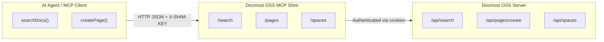

# Docmost OSS MCP Shim

A lightweight Node.js bridge that allows AI agents (such as **Cursor MCP**, **Claude Code**, or other Model Context Protocol tools) to read and write documentation in a **self-hosted Docmost (OSS)** instance.

The goal:  
✅ No Enterprise license.  
✅ No manual cookie juggling.  
✅ Simple REST interface your agent can talk to.

---

## 🚀 Why This Exists

Docmost’s Open Source (Community Edition) doesn’t support API keys or external programmatic access by default.  
This shim provides a **secure, stateless adapter** that:

- Logs into Docmost using standard user credentials (via cookie session)
- Caches the session automatically and refreshes it when expired
- Exposes a minimal, agent-friendly API for:
  - Listing workspaces (spaces)
  - Searching content
  - Creating and updating pages

This enables a coding agent (e.g. MCP in Cursor) to **query or update your documentation automatically** — no manual editing required.

---

## 🧩 Features

| Endpoint  | Method | Description                     |
| --------- | ------ | ------------------------------- |
| `/health` | GET    | Check if the shim is running    |
| `/spaces` | GET    | List available Docmost spaces   |
| `/search` | POST   | Search Docmost content by query |
| `/pages`  | POST   | Create a new page               |
| `/pages`  | PUT    | Update an existing page         |

All proxied internally to your `DOCMOST_BASE_URL` (the self-hosted instance).

---

## ⚙️ Setup

### 1️⃣ Requirements

- Node **v22+**
- A running self-hosted **Docmost OSS** instance (Docker or bare-metal)
- A Docmost user account for the shim (e.g. `my.docmost.mcp.user@gmail.com`)

### 2️⃣ Clone and install

```bash
git clone https://github.com/dJPoida/docmost-oss-mcp-shim.git
cd docmost-oss-mcp-shim
npm install
```

### 3️⃣ Configure environment

Create a `.env` file (copy from `.env.example`):

```ini
DOCMOST_BASE_URL=YOUR_DOCMOST_BASE_URL
DOCMOST_EMAIL=YOUR_DEDICATED_MCP_USER_EMAIL
DOCMOST_PASSWORD=YOUR_DEDICATED_MCP_USER_PASSWORD

# Shim network config
HOST=127.0.0.1
PORT=3888

# Optional shared secret (required header: X-SHIM-KEY)
SHIM_API_KEY=change-this-long-random-string
```

---

## ▶️ Run

```bash
npm start
```

Then test:

```bash
# health check
curl http://127.0.0.1:3888/health

# list spaces
curl -H "X-SHIM-KEY: change-this-long-random-string"      http://127.0.0.1:3888/spaces
```

---

## 🧠 How It Works

1. On startup, the shim logs into your Docmost instance via `/api/auth/login`.
2. A cookie session is stored and automatically refreshed every 6 hours.
3. Incoming requests (from MCP or other tools) are proxied to Docmost.
4. Failed auth (HTTP 401) triggers an automatic re-login and retry.

---

## 🔒 Security

- **Never** expose this directly to the public internet.  
  Bind to localhost (`HOST=127.0.0.1`) and reverse-proxy through NGINX if remote access is needed.
- Use a long, random `SHIM_API_KEY` if any external agent will call it.
- Don’t reuse your main admin Docmost account — create a dedicated integration user.
- `.env` and cookies are excluded from Git by default.

---

## 🧰 Example MCP Integration

Point your MCP configuration to the shim endpoints instead of Docmost directly:

```json
{
  "tools": {
    "docmost": {
      "baseUrl": "http://127.0.0.1:3888",
      "headers": { "X-SHIM-KEY": "change-this-long-random-string" }
    }
  }
}
```

Now your agent can run queries like:

- `POST /search` → `{"query": "authentication flow"}`
- `POST /pages` → `{"spaceId": "...", "title": "API Integration", "content": "..."}`

---

## 🧑‍💻 Development

```bash
npm run dev     # (if nodemon configured)
npm run lint    # run ESLint
npm run format  # run Prettier
```

---

## 🐳 Optional: Docker

```bash
docker build -t docmost-oss-mcp-shim .
docker run -d --env-file .env -p 127.0.0.1:3888:3888 docmost-oss-mcp-shim
```

---

## 🩵 License

MIT — freely reusable for self-hosted setups.  
Not affiliated with the official Docmost team.

---

## 🔁 Architecture Overview


